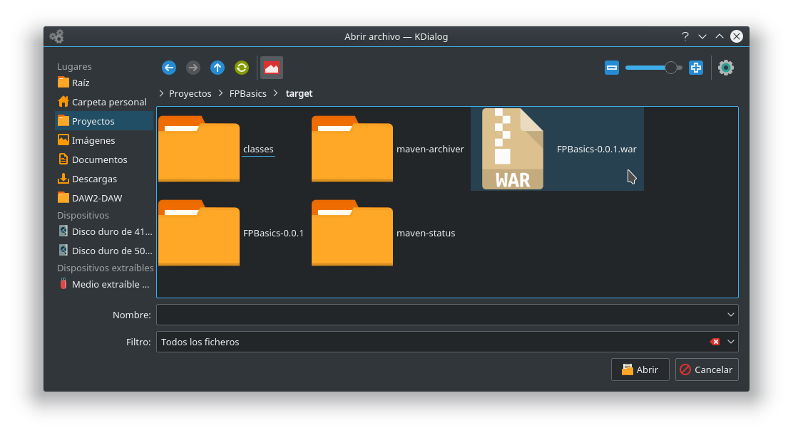
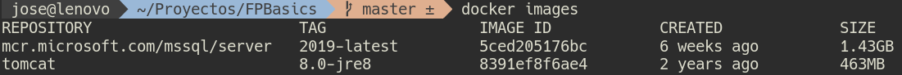
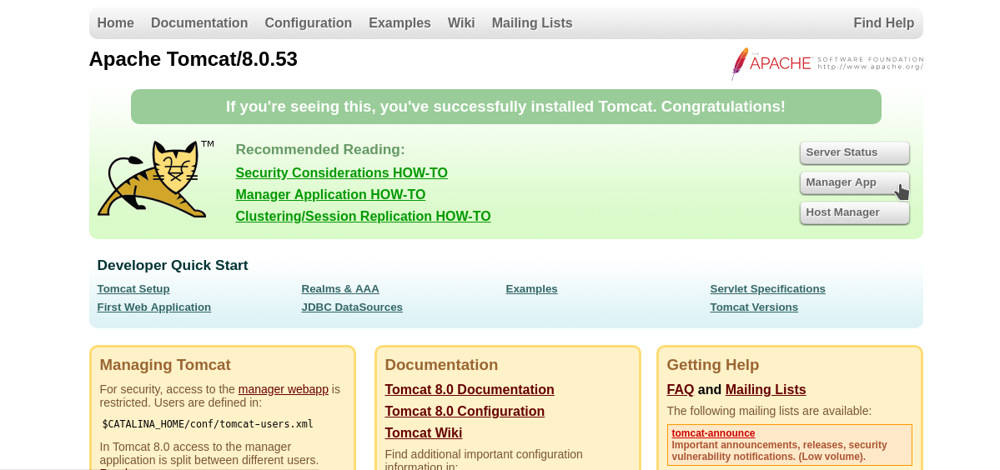
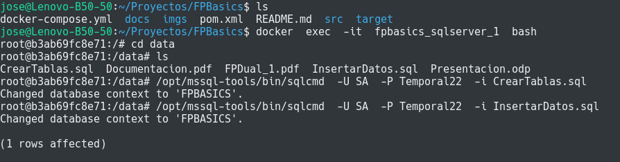

# FPBasics
Aplicación Java con acceso a Base de Datos Relacional

## Introducción

Este proyecto es un adaptación del proyecto de ASIR2 del curso 2017-18 siguiente:

- [FPBasics original](https://github.com/JPimenton/FPBasics-Final)

que fue realizado por los siguientes alumnos:

- [García Jiménez, Javier](https://github.com/JPimenton) :octocat: `JPimenton`
- [Rosa Martín, Francisco Javier](https://github.com/xaviroma) :octocat: `xaviroma` 
- [Saavedra Conejo, Luciano](https://github.com/lucisaavedra98) :octocat: `lucisaavedra98` 

El proyecto ha sido modificado para desplegarlo en **contenedores docker**. Sirve como material didáctico para el módulo Despliegue de Aplicaciones Web de 2º DAW del curso 2018-19.

La documentación de este proyecto está accesible en [este enlace](docs).

## Software utilizado


## Despliegue local en Tomcat+SQLServer con contenedores docker

A continuación se muestran los pasos para desplegar la aplicación en el **Contenedor de servlets y servidor web Tomcat** (Version 8.0.53). También necesitaremos el **Gestor de BBDD MS SQL Server** (Versión 2017 Express Edition).

Para ello necesitaremos cada uno de estos contenedores. Ambos están disponibles en [DockerHub](https://hub.docker.com).

- https://hub.docker.com/_/tomcat/ . Usaremos el **tag 8.0-jre8**
- https://hub.docker.com/r/microsoft/mssql-server-linux/ . Usaremos el **tag 2017-latest**


### Pasos a seguir

Los pasos que siguen se han realizado en SO GNU/Linux. Ha funcionado en Ubuntu 16.04 y en Ubuntu 18.04.

1) Instalamos el software básico

```bash
sudo  apt  install  docker.io  docker-compose  maven  git
```

2) Descargamos código fuente del proyecto y entramos en la carpeta

```bash
git  clone  https://github.com/jamj2000/FPBasics.git
cd  FPBasics
```

3) Probamos maven

```bash
mvn
```

Debe apareceer algo parecido a lo siguiente:


Nos aparecen bastantes metas:

`validate, initialize, generate-sources, process-sources, generate-resources, process-resources, compile, process-classes, generate-test-sources, process-test-sources, generate-test-resources, process-test-resources, test-compile, process-test-classes, test, prepare-package,` **`package`** `, pre-integration-test, integration-test, post-integration-test, verify, install, deploy, pre-clean,` **`clean`**, `post-clean, pre-site, site, post-site, site-deploy`

Ahora mismo nos interesa la meta `package`.

4) Ejecutamos la meta para generar un paquete

```bash
mvn  package
```


Esto debería crear una carpeta `target` y dentro un archivo `FPBasics-0.0.1.war`.




5) Comprobamos que el archivo `docker-compose.yml` tiene el siguiente contenido: 

```
cat  docker-compose.yml
```

```yaml
version: "2"
services:
    tomcat:
        image: "tomcat:8.0-jre8"
        ports:
            - "8080:8080"
        depends_on:
            - sqlserver
    sqlserver:
        image: "microsoft/mssql-server-linux:2017-latest"
        environment:
            SA_PASSWORD: "Temporal22"
            ACCEPT_EULA: "Y"
        volumes:
            ./docs/:/data

```

6) Ejecutamos 

```
docker-compose  up  -d
```

Este comando descargará las imágenes indicadas anteriormente y creará un contenedor por cada una de ellas. 


Deberían haberse bajado las imágenes y lanzado 2 contenedores, con nombres:

- fpbasics_tomcat_1
- fpbasics_sqlserver_1

**AVISO:** Las 2 imágenes ocupan un total de unos 2 GB aproximadamente.



Con el comando `docker images` podemos ver las imágenes descargadas en nuestro disco. En la imagen anterior se pueden ver las imágenes que tengo yo en el disco de mi servidor. A tí deberían aparecerte las siguientes:

- `tomcat:8.0-jre8` (463MB)
- `microsoft/mssql-server-linux:2017-latest` (1.44GB)


7) Si todo ha ido bien, abriremos la URL `localhost:8080` en el navegador y veremos lo siguiente:


8) Podemos comprobar que necesitamos autenticación para acceder a `Server Status`, `Manager App` y `Host Manager`.

Para solucionar esto debemos modificar el contenedor. Los pasos son:

- Entramos en el contenedor de tomcat
  ```
  docker  exec  -it  fpbasics_tomcat_1  bash
  ```

- Editamos el archivo `/usr/local/tomcat/conf/tomcat-users.xml`
  Puesto que el contenedor no tiene instalado ningún editor de texto, instalaremos `nano` dentro del contenedor.
  
  
  
  Y luego el final del archivo debe quedar así:
  
  
    
  Las líneas e insertar son:
  ```xml
  <role rolename="manager-gui"/>
  <role rolename="admin-gui"/>
  <user username="tomcat" password="tomcat" roles="manager-gui,admin-gui"/>
  ```  

9) Salimos del contenedor. 
   Es aconsejable guardar los cambios hechos en el contenedor en una nueva imagen. La llamaré `tomcat:fpbasics`. Así en un futuro podré crear contenedores nuevos a partir de la nueva imagen, que ya tendrá los cambios previos.
   
   Para crear la nueva imagen a partir de un contenedor modificado hacemos:
   ```
   docker  commit  fpbasics_tomcat_1  tomcat:fpbasics
   ```
   
   

10) Reiniciamos el contenedor.
   
   ```bash
   docker  restart  fpbasics_tomcat_1
   ```
   
11) Refrescamos la página `localhost:8080` y entramos en `Manager App` con el usuario y clave configurados anteriormente.

 

 


12) Si todo ha ido bien veremos el `Gestor de Aplicaciones`

  


13) Desplegamos el archivo `FPBasics-0.0.1.war`

  Nos vamos a la sección `Archivo WAR a desplegar` y pulsamos en `Seleccionar archivo`.
  

  Buscamos el archivo en la carpeta `target`
  

  Pulsamos en el botón `Desplegar` y nos debe aparecer en la sección `Aplicaciones`.  
  
  
  Si pulsamos en dicho enlace debemos ver la aplicación desplegada.
  
  Para actualizar la nueva imagen a partir del contenedor modificado hacemos:
  ```
  docker  commit  fpbasics_tomcat_1  tomcat:fpbasics
  ```

14) Accedemos a la aplicación. La clave de acceso es `usuario`

  

  

15) ¿Y los datos? 
   El contenedor `fpbasics_sqlserver_1` no tiene datos introducidos. Así que la aplicación dará una excepción cuando intentemos consultar algunas de las tablas.
  
Para solucionar esto debemos modificar el contenedor. Los pasos son:

- Entramos en el contenedor de sqlserver
  ```bash
  docker  exec  -it  fpbasics_sqlserver_1  bash
  ```

- Ejecutamos los scripts `CrearTablas.sql` e `InsertarDatos.sql` con el comando `sqlcmd`.

  ```bash
  cd /data 
  ls
  /opt/mssql-tools/bin/sqlcmd -U SA -P Temporal22 -i CrearTablas.sql
  /opt/mssql-tools/bin/sqlcmd -U SA -P Temporal22 -i InsertarDatos.sql
  ```
  
  
 
  > NOTA: Da algunos avisos, puesto que los datos están incompletos.
  

16) Salimos del contenedor. 
   Es aconsejable guardar los cambios hechos en el contenedor en una nueva imagen. La llamaré `sqlserver:fpbasics`. Así en un futuro podré crear contenedores nuevos a partir de la nueva imagen, que ya tendrá los cambios previos.   
   
   Para crear la nueva imagen a partir de un contenedor modificado hacemos:
   
   ```bash
   docker  commit  fpbasics_sqlserver_1  sqlserver:fpbasics
   ```     
   


17)  Resultado final

  


18) **BONUS**

Si utilizamos el archivo `docker-compose.tomcat.yml` podemos lanzar los contenedores con todos los cambios previos ya realizados. Se descargaran las imagenes con los commits desde [mi cuenta en DockerHub](https://hub.docker.com/r/jamj2000/).

Para ello detenemos los contenedores previos:

```bash
docker-compose  down
```

Y lanzamos los contenedores desde las imágenes modificadas:

```bash
docker-compose -f docker-compose.tomcat.yml  up  -d
```


## Despliegue local en WildFly+SQLServer con contenedores docker

A continuación se muestran los pasos para desplegar la aplicación en el **Servidor de aplicaciones WildFly** (Version 8.2.1.Final). También necesitaremos el **Gestor de BBDD MS SQL Server** (Versión 2017 Express Edition).

Para ello necesitaremos cada uno de estos contenedores. Ambos están disponibles en [DockerHub](https://hub.docker.com).

- https://hub.docker.com/r/jboss/wildfly/ . Usaremos el **tag 8.2.1.Final**
- https://hub.docker.com/r/jamj2000/sqlserver/ . Usaremos el **tag fpbasics** (creado previamente)


### Pasos a seguir

Los pasos que siguen se han realizado en SO GNU/Linux. Ha funcionado en Ubuntu 16.04 y en Ubuntu 18.04.

1) Instalamos el software básico

```bash
sudo  apt  install  docker.io  docker-compose  openjdk-8-jdk  openjdk-8-jre  maven  git
```

2) Descargamos código fuente del proyecto y entramos en la carpeta

```bash
git  clone  https://github.com/jamj2000/FPBasics.git
cd  FPBasics
```

3) Probamos maven

```bash
mvn
```

Debe apareceer algo parecido a lo siguiente:


Nos aparecen bastantes metas:

`validate, initialize, generate-sources, process-sources, generate-resources, process-resources, compile, process-classes, generate-test-sources, process-test-sources, generate-test-resources, process-test-resources, test-compile, process-test-classes, test, prepare-package,` **`package`** `, pre-integration-test, integration-test, post-integration-test, verify, install, deploy, pre-clean,` **`clean`**, `post-clean, pre-site, site, post-site, site-deploy`

Ahora mismo nos interesa la meta `package`.

4) Ejecutamos las metas para limpiar y generar nuevo paquete según el archivo `pom.wildfly.xml`.

```bash
mvn  clean  package  -f pom.wildfly.xml 
```
Necesitamos usar el archivo `pom.wildfly.xml` en lugar del `pom.xml` original, puesto que WildFly ya dispone de algunos artefactos que no es necesario incorporar. En concreto hemos añadido la línea `<scope>provided</scope>` a los artefactos jsf-api y jsf-impl. Los archivos .jar correspondientes se generan y almacenan en `target/FPBasics-0.0.1/WEB-INF/lib/`.

 

Esto debería eliminar y volver a crear la carpeta `target` y dentro un archivo `FPBasics-0.0.1.war`.


5) Comprobamos que el archivo `docker-compose.wildfly.yml` tiene el siguiente contenido: 

```
cat  docker-compose.wildfly.yml
```

**docker-compose.wildfly.yml**

```yaml
version: "2"
services:
    wildfly:
        build:
             context: .
             dockerfile: Dockerfile.wildfly
        image: jamj2000/wildfly:fpbasics
        ports:
            - "8080:8080"
        depends_on:
            - sqlserver
    sqlserver:
        image: "jamj2000/sqlserver:fpbasics"
        environment:
            SA_PASSWORD: "Temporal22"
            ACCEPT_EULA: "Y"
```

En el archivo anterior indicamos que vamos a crear la imagen `jamj2000/wildfly` y para ello usaremos el archivo `Dockerfile.wildfly`, que tiene el siguiente contenido:

**Dockerfile.wildfly**
```
FROM  jboss/wildfly:8.2.1.Final
ADD  target/FPBasics-0.0.1.war  /opt/jboss/wildfly/standalone/deployments/
```

Utilizando la imagen `jboss/wildfly:8.2.1.Final`, vamos a copiar el archivo `target/FPBasics-0.0.1.war` dentro de la carpeta   `/opt/jboss/wildfly/standalone/deployments/` de dicha imagen. Esto nos servirá para crear la nueva imagen `jamj2000/wildfly:fpbasics` que habíamos indicado previamente en el archivo docker-compose.wildfly.yml.


6) Para generar la imagen previa, descargar las imágenes que nos falten y lanzar los 2 contenedores necesarios, ejecutamos 

```
docker-compose  -f docker-compose.wildfly.yml  up  -d
```

Es importante escribir las opciones y argumentos en el orden que se indica previamente. Como hemos dicho para realizar todo el trabajo seguiremos las indicaciones del archivo `docker-compose.wildfly.yml`. 

**AVISO: Asegurate de parar cualquier servicio que tengas a la escucha en el puerto 8080, como Tomcat. WildFly utiliza también el puerto 8080.**

Para eliminar los contenedores previos, en el caso de tenerlos:

```bash
docker-compose  rm  fpbasics_tomcat_1  -f
docker-compose  rm  fpbasics_sqlserver_1  -f
```

No te preocupes, no hemos borrado las imágenes del disco, por tanto en cualquier momento podríamos volver a lanzarlos.


Deberían haberse bajado las imágenes `jboss/wildfly:8.2.1.Final` y `jamj2000/sqlserver:fpbasics`, en caso de no tenerlas en disco ya, haberse creado la imagen `jamj2000/wildfly:fpbasics` y lanzado 2 contenedores, con nombres:

- fpbasics_wildfly_1
- fpbasics_sqlserver_1

**AVISO:** Las 2 imágenes ocupan un total de unos 2.2 GB aproximadamente.

Con el comando `docker images` podemos ver las imágenes descargadas en nuestro disco. A tí deberían aparecerte al menos las siguientes:

- `jboss/wildfly:8.2.1.Final` (610MB)
- `microsoft/mssql-server-linux:2017-latest` (1.44GB)


7) Si todo ha ido bien, abriremos la URL `localhost:8080` en el navegador y veremos lo siguiente:


8) Accedemos a la aplicación. La clave de acceso es `usuario`

  


9) ¿Y los datos? 
   El contenedor `fpbasics_sqlserver_1` que tenemos se basa en una imagen que habíamos modificado previamente y la cual contiene los datos. Por tanto este problema está resuelto.
  
  No obstante podemos asegurarnos, entrando al contenedor y usando `sqlcmd` para realizar consultas.

  - Entramos en el contenedor de sqlserver
  ```bash
  docker  exec  -it  fpbasics_sqlserver_1  bash
  ```

  - Ejecutamos el comando `sqlcmd`.

  ```bash
  /opt/mssql-tools/bin/sqlcmd -U SA -P Temporal22 
  
  ```
 
10) **BONUS**

  Desde [mi cuenta en DockerHub](https://hub.docker.com/r/jamj2000/) puedes bajarte las imágenes modificadas.


