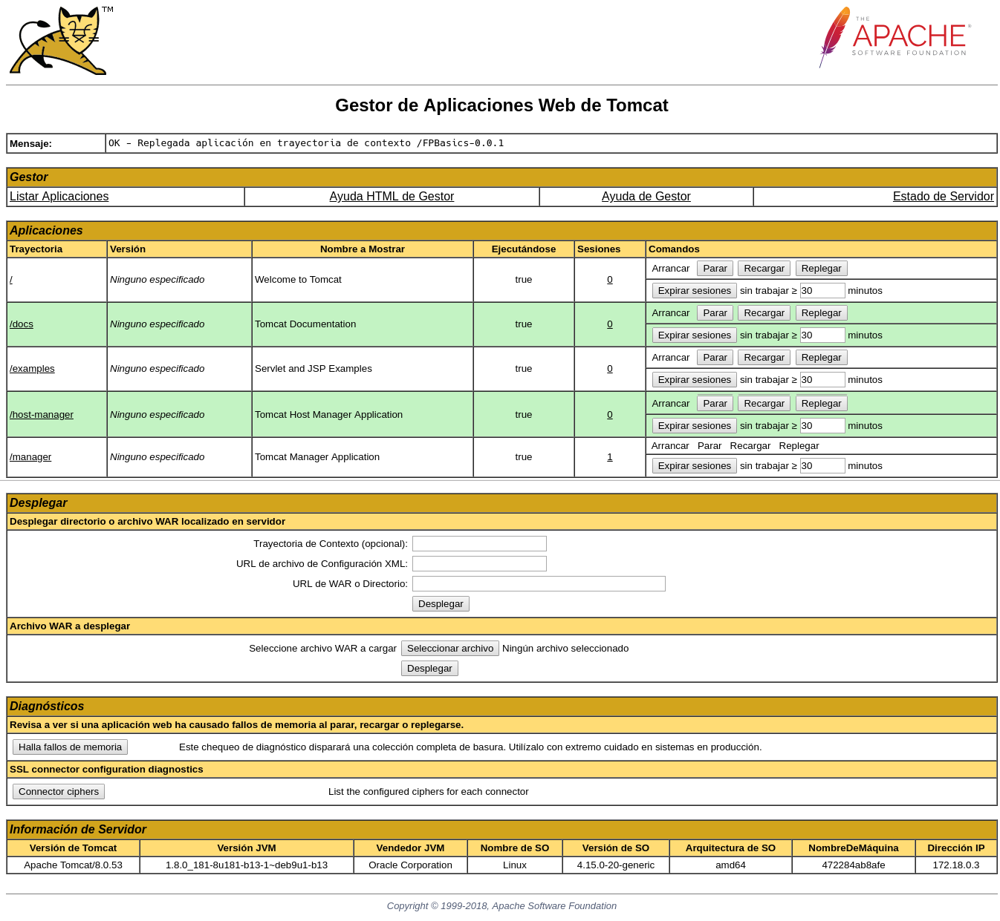

# FPBasics
Aplicación Java con acceso a Base de Datos Relacional

## Introducción

Este proyecto es un adaptación del proyecto de ASIR2 del curso 2017-18 siguiente:

- [FPBasics original](https://github.com/JPimenton/FPBasics-Final)

que fue realizado por los siguientes alumnos:

- [García Jiménez, Javier](https://github.com/JPimenton) :octocat: `JPimenton`
- [Rosa Martín, Francisco Javier](https://github.com/xaviroma) :octocat: `xaviroma` 
- [Saavedra Conejo, Luciano](https://github.com/lucisaavedra98) :octocat: `lucisaavedra98` 

El proyecto ha sido modificado para desplegarlo en **contenedores docker**. Sirve como material didáctico para el módulo Despliegue de Aplicaciones Web de 2º DAW del curso 2018-19.

La documentación de este proyecto está accesible en [este enlace](docs).

## Software utilizado


## Despliegue local con contenedores docker

A continuación se muestran los pasos para desplegar la aplicación en el **Servidor de Aplicaciones Tomcat** (Version 8.0.53). También necesitaremos el **Gestor de BBDD MS SQL Server** (Versión 2017 Express Edition).

Para ello necesitaremos cada uno de estos contenedores. Ambos están disponibles en [DockerHub](https://hub.docker.com).

- https://hub.docker.com/_/tomcat/ . Usaremos el **tag 8.0-jre8**
- https://hub.docker.com/r/microsoft/mssql-server-linux/ . Usaremos el **tag 2017-latest**


### Pasos a seguir

Los pasos que siguen se han realizado en SO GNU/Linux. Ha funcionado en Ubuntu 16.04 y en Ubuntu 18.04.

1) Instalamos el software básico

```bash
sudo  apt  install  docker.io  docker-compose  maven  git
```

2) Descargamos código fuente del proyecto y entramos en la carpeta

```bash
git  clone  https://github.com/jamj2000/FPBasics.git
cd  FPBasics
```

3) Probamos maven

```bash
mvn
```

Debe apareceer algo parecido a lo siguiente:


Nos aparecen bastentes metas:

`validate, initialize, generate-sources, process-sources, generate-resources, process-resources, compile, process-classes, generate-test-sources, process-test-sources, generate-test-resources, process-test-resources, test-compile, process-test-classes, test, prepare-package,` **`package`** `, pre-integration-test, integration-test, post-integration-test, verify, install, deploy, pre-clean,` **`clean`**, `post-clean, pre-site, site, post-site, site-deploy`

Ahora mismo nos interesa la meta `package`.

4) Ejecutamos la me


ta (goal) para generar un paquete

```bash
mvn  package
```


Esto debería crear una carpeta `target` y dentro un archivo `FPBasics-0.0.1.war`.


5) Comprobamos que el archivo `docker-compose.yml` tiene el siguiente contenido: 

```
cat  docker-compose.yml
```

```yaml
version: "2"
services:
    tomcat:
        image: "tomcat:8.0-jre8"
        ports:
            - "8080:8080"
        depends_on:
            - sqlserver
    sqlserver:
        image: "microsoft/mssql-server-linux:2017-latest"
        environment:
            SA_PASSWORD: "Temporal22"
            ACCEPT_EULA: "Y"
        volumes:
            ./docs/:/data

```

6) Ejecutamos 

```
docker-compose  up  -d
```

Este comando descargará las imágenes indicadas anteriormente y creará un contenedor por cada una de ellas. 


Deberían haberse bajado las imágenes y lanzado 2 contenedores, con nombres:

- fpbasics_tomcat_1
- fpbasics_sqlserver_1

**AVISO:** Las 2 imágenes ocupan un total de unos 2 GB aproximadamente.


Con el comando `docker images` podemos ver las imágenes descargadas en nuestro disco. En la imagen anterior se pueden ver las imágenes que tengo yo en el disco de mi servidor. A tí deberían aparecerte las siguientes:

- `tomcat:8.0-jre8` (463MB)
- `microsoft/mssql-server-linux:2017-latest` (1.44GB)


7) Si todo ha ido bien, abriremos la URL `localhost:8080` en el navegador y veremos lo siguiente:


8) Podemos comprobar que necesitamos autenticación para acceder a `Server Status`, `Manager App` y `Host Manager`.

Para solucionar esto debemos modificar el contenedor. Los pasos son:

- Entramos en el contenedor de tomcat
  ```
  docker  exec  -it  fpbasics_tomcat_1  bash
  ```

- Editamos el archivo `/usr/local/tomcat/conf/tomcat-users.xml`
  Puesto que el contenedor no tiene instalado ningún editor de texto, instalaremos `nano` dentro del contenedor.
  
  
  
  Y luego el final del archivo debe quedar así:
  
  
    
  Las líneas e insertar son:
  ```xml
  <role rolename="manager-gui"/>
  <role rolename="admin-gui"/>
  <user username="tomcat" password="tomcat" roles="manager-gui,admin-gui"/>
  ```  

9) Salimos del contenedor. 
   Es aconsejable guardar los cambios hechos en el contenedor en una nueva imagen. La llamaré `tomcat:fpbasics`. Así en un futuro podré crear contenedores nuevos a partir de la nueva imagen, que ya tendrá los cambios previos.
   
   Para crear la nueva imagen a partir de un contenedor modificado hacemos:
   ```
   docker  commit  fpbasics_tomcat_1  tomcat:fpbasics
   ```
   
   

10) Reiniciamos el contenedor.
   
   ```bash
   docker  restart  fpbasics_tomcat_1
   ```
   
11) Refrescamos la página `localhost:8080` y entramos en `Manager App` con el usuario y clave configurados anteriormente.

 

 


12) Si todo ha ido bien veremos el `Gestor de Aplicaciones`

  


13) Desplegamos el archivo `FPBasics-0.0.1.war`

  Nos vamos a la sección `Archivo WAR a desplegar` y pulsamos en `Seleccionar archivo`.
  

  Buscamos el archivo en la carpeta `target`
  

  Pulsamos en el botón `Desplegar` y nos debe aparecer en la sección `Aplicaciones`.  
  
  
  Si pulsamos en dicho enlace debemos ver la aplicación desplegada.

14) Accedemos a la aplicación. La clave de acceso es `usuario`

  

  

15) ¿Y los datos? 
   El contenedor `fpbasics_sqlserver_1` no tiene datos introducidos. Así que la aplicación dará una excepción cuando intentemos consultar algunas de las tablas.
  
Para solucionar esto debemos modificar el contenedor. Los pasos son:

- Entramos en el contenedor de sqlserver
  ```bash
  docker  exec  -it  fpbasics_sqlserver_1  bash
  ```

- Ejecutamos los scripts `CrearTablas.sql` e `InsertarDatos.sql` con el comando `sqlcmd`.

  ```bash
  cd /data 
  ls
  /opt/mssql-tools/bin/sqlcmd -U SA -P Temporal22 -i CrearTablas.sql
  /opt/mssql-tools/bin/sqlcmd -U SA -P Temporal22 -i InsertarDatos.sql
  ```
  
  
 
  > NOTA: Da algunos avisos, puesto los datos están incompletos.
  

16) Salimos del contenedor. 
   Es aconsejable guardar los cambios hechos en el contenedor en una nueva imagen. La llamaré `sqlserver:fpbasics`. Así en un futuro podré crear contenedores nuevos a partir de la nueva imagen, que ya tendrá los cambios previos.   
   
   Para crear la nueva imagen a partir de un contenedor modificado hacemos:
   
   ```bash
   docker  commit  fpbasics_sqlserver_1  sqlserver:fpbasics
   ```     
   


17)  Resultado final

  


