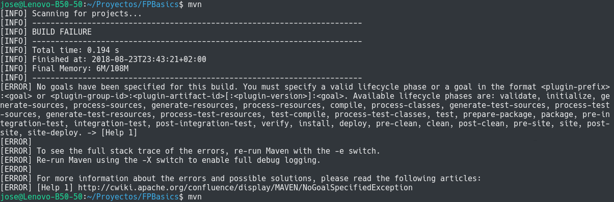

# FPBasics
Aplicación Java con acceso a Base de Datos Relacional

## Introducción

Este proyecto es un adaptación del proyecto de ASIR2 del curso 2017-18 siguiente:

- [FPBasics original](https://github.com/JPimenton/FPBasics-Final)

que fue realizado por los siguientes alumnos:

- [García Jiménez, Javier](https://github.com/JPimenton) :octocat: `JPimenton`
- [Rosa Martín, Francisco Javier](https://github.com/xaviroma) :octocat: `xaviroma` 
- [Saavedra Conejo, Luciano](https://github.com/lucisaavedra98) :octocat: `lucisaavedra98` 

El proyecto ha sido modificado para desplegarlo en **contenedores docker**. Sirve como material didáctico para el módulo Despliegue de Aplicaciones Web de 2º DAW del curso 2018-19.

La documentación de este proyecto está accesible en [este enlace](docs).

## Software utilizado


## Despliegue local con contenedores docker

A continuación se muestran los pasos para desplegar la aplicación en el **Servidor de Aplicaciones Tomcat** (Version 8.0.53). También necesitaremos el **Gestor de BBDD MS SQL Server** (Versión 2017 Express Edition).

Para ello necesitaremos cada uno de estos contenedores. Ambos están disponibles en [DockerHub](https://hub.docker.com).

- https://hub.docker.com/_/tomcat/ . Usaremos el **tag 8.0-jre8**
- https://hub.docker.com/r/microsoft/mssql-server-linux/ . Usaremos el **tag 2017-latest**


### Pasos a seguir

Los pasos que siguen se han realizado en SO GNU/Linux. Ha funcionado en Ubuntu 16.04 y en Ubuntu 18.04.

1) Instalamos el software básico

```bash
sudo  apt  install  docker.io  docker-compose  maven  git
```

2) Descargamos código fuente del proyecto y entramos en la carpeta

```bash
git  clone  https://github.com/jamj2000/FPBasics.git
cd  FPBasics
```

3) Probamos maven

```bash
mvn
```

Debe apareceer algo parecido a lo siguiente:




Nos aparecen bastentes metas:

`validate, initialize, generate-sources, process-sources, generate-resources, process-resources, compile, process-classes, generate-test-sources, process-test-sources, generate-test-resources, process-test-resources, test-compile, process-test-classes, test, prepare-package,` **`package`** `, pre-integration-test, integration-test, post-integration-test, verify, install, deploy, pre-clean,` **`clean`**, `post-clean, pre-site, site, post-site, site-deploy`

Ahora mismo nos interesa la meta `package`.

4) Ejecutamos la me


ta (goal) para generar un paquete

```bash
mvn  package
```


5) Comprobamos que el archivo `docker-compose.yml` tiene el siguiente contenido: 

```
cat  docker-compose.yml
```

```yaml
version: "2"
services:
    tomcat:
        image: "tomcat:8.0-jre8"
        ports:
            - "8080:8080"
        depends_on:
            - sqlserver
    sqlserver:
        image: "microsoft/mssql-server-linux:2017-latest"
        environment:
            SA_PASSWORD: "Temporal22"
            ACCEPT_EULA: "Y"
```

6) Ejecutamos 

```
docker-compose  up  -d
```

Este comando descargará las imágenes indicadas anteriormente y creará un contenedor por cada una de ellas. 


**AVISO:** Las 2 imágenes ocupan un total de unos 2 GB aproximadamente.


Con el comando `docker images` podemos ver las imágenes descargadas en nuestro disco. En la imagen anterior se pueden ver las imágenes que tengo yo en el disco de mi servidor. A tí deberían aparecerte las siguientes:

- `tomcat:8.0-jre8` (463MB)
- `microsoft/mssql-server-linux:2017-latest` (1.44GB)


7) Si todo ha ido bien, abriremos la URL `localhost:8080` en el navegador y veremos lo siguiente:


8) 

tomcat-manager.png

tomcat-autenticacion.png

tomcat-gestor-aplicaciones.png


```bash
docker run -d -p 8080:8080 --name tomcat tomcat:8.0-jre8
docker run -e "ACCEPT_EULA=Y" -e "SA_PASSWORD=Temporal22" --name sqlserver -v /ruta/absoluta/scripts:/data -p 1433:1433 -d microsoft/mssql-server-linux:2017-latest
```

Entramos en el contenedor `sqlserver` 

```bash
docker exec -it sqlserver bash
cd /data
/opt/mssql-tools/bin/sqlcmd -U SA -P Curso2017-18 -i CrearTablas.sql
/opt/mssql-tools/bin/sqlcmd -U SA -P Curso2017-18 -i InsertarDatos.sql
```


```

tomcat-desplegar.png
tomcat-desplegar-proyecto.png
tomcat-fpbasics1.png
tomcat-fpbasics2.png
tomcat-fpbasics3.png

```
